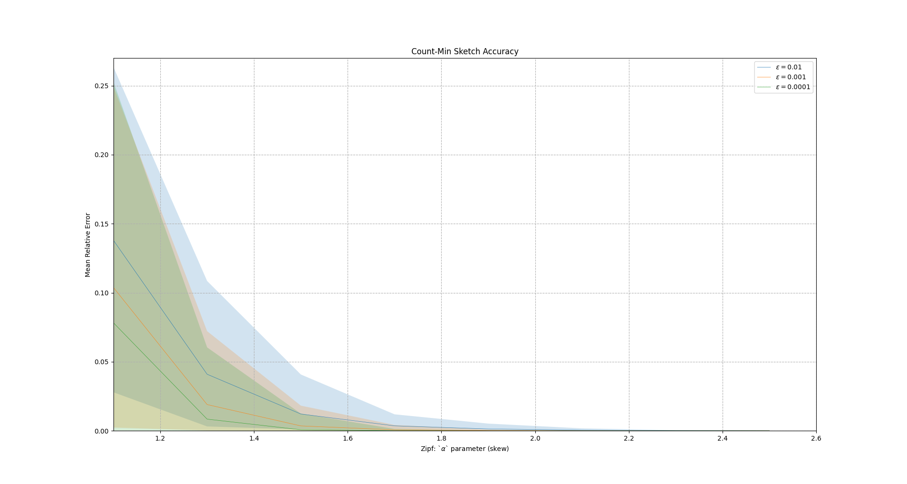

# Experimental Evaluation

In order to verify the accuracy of the CountMin sketch implementation we 
generated `20` files with random numbers sampled from a 
[Zipf distribution](https://en.wikipedia.org/wiki/Zipf%27s_law). We varied 
the Zipf's `alpha` parameter from `1.1` to `2.5` to produce datasets with 
different skewness.

The values of each file were inserted in a CountMin sketch and the mean
relative error of the frequencies of the heavy hitters were calculated. We
repeated this process for three different `epsilon` values. The results as
displayed below.

## Usage

To reproduce the experiments follow the steps in [exp.py](./exp.py).

## References

- ["An Improved Data Stream Summary: The Count-Min Sketch and its Applications."](http://dimacs.rutgers.edu/~graham/pubs/papers/cm-full.pdf)

- ["Finding Frequent Items in Data Streams."](https://www.vldb.org/pvldb/vol1/1454225.pdf)

- ["Zipf's Law"](https://en.wikipedia.org/wiki/Zipf%27s_law)
